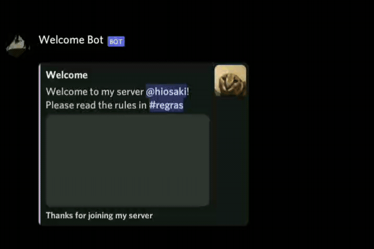
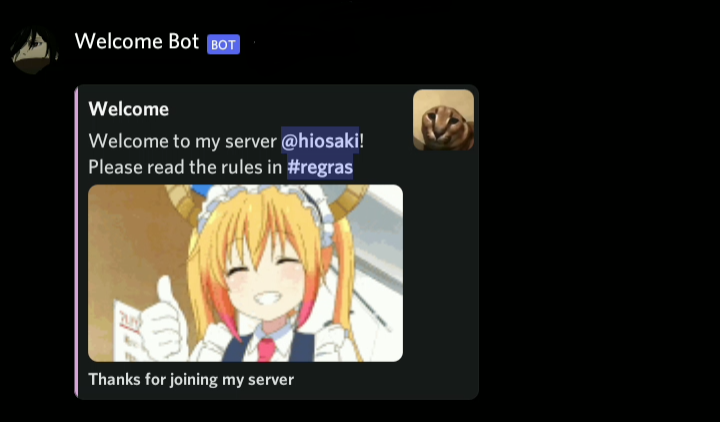

# Welcome Bot

Bot made in python for welcome channels.
I had the help of 2 friends to test it, () and ()

## Overview



____

## How to configure ?

Put the information in the file ```config.json```

## How to costumize ?
In the code, I put some comments indicating where the GIF is if you want to change it
If you want to change the colors, I'll leave a table with some examples below:

_Made By s3nsh1_
